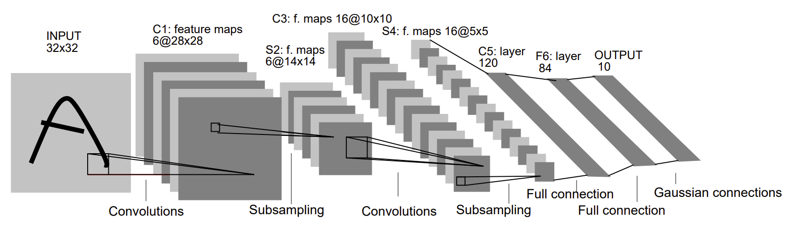

# ECE408 Final Project - CNN

## Table of Contents

 - [Introduction](#introduction)
 - [Notes on Working Alone](#notes-on-working-alone)
 - [Milestone 1](#milestone-1-basic-cpu-and-gpu-convolution-implementation)
 - [Milestone 2](#milestone-2-profiling-convolution-and-implementing-kernel-fusion)
 - [Milestone 3](#milestone-3-gpu-convolution-kernel-optimizations)
 - [Rubric](#tentative-rubric)
 - [Deadlines](#milestone-deadlines)
 - [License](#license)
 - [Contributors](#contributors)

## Introduction

In this final project, you will be implementing and optimizing the forward-pass of a convolutional layer using CUDA. You will be provided a pre-trained model with all layers implemented besides the convolutional layers. Convolutional layers are the primary building blocks of convolutional neural networks (CNNs), which are used in many machine learning tasks like image classification, object detection, natural language processing, and recommendation systems. In general, CNNs work well on tasks where the data/input features have some level of spatial relationship.

You will be working with a **modified** version of the LeNet-5 architecture shown below.

*Source: http://vision.stanford.edu/cs598_spring07/papers/Lecun98.pdf*

Your optimized CUDA implementation of the convolutional layer will be used to perform inference for layers C1 and C3 in the figure above. We will be leveraging the [mini-dnn-cpp](https://github.com/iamhankai/mini-dnn-cpp) (Mini-DNN) framework for implementing the modified LeNet-5.

We will be using the [Fashion MNIST dataset](https://github.com/zalandoresearch/fashion-mnist), where the inputs to the network will be a batch of 10,000 single channel images, each with dimensions of 86 x 86 pixels. The output layer consists of 10 nodes, where each node represents the likelihood of the input belonging to one of the 10 classes (T-shirt, dress, sneaker, boot, etc.)

The overall learning objectives for this project are:
* Demonstrate command of CUDA and optimization approaches by designing and implementing an optimized neural-network convolutional layer forward pass
* Obtaining practical experience in analyzing and fine tuning CUDA kernels through the use of profiling tools like Nsight Systems (`nsys`) and Nsight-Compute (`ncu`)

You will be working on this project individually. We will release the code for project milestones one at a time.

*You are expected to adhere to University of Illinois academic integrity standards. Do not attempt to subvert any of the performance-measurement aspects of the final project. If you are unsure about whether something does not meet those guidelines, ask a member of the teaching staff.*

### Industry Relevance

CNNs revolutionized the field of computer vision by introducing an architecture that mimics the human visual system's ability to recognize patterns through hierarchical feature extraction. Historically, the success of AlexNet in the 2012 ImageNet challenge marked the beginning of the deep learning era, moving the industry away from manual "feature engineering" toward automated, end-to-end learning. Today, while transformers dominate natural language processing, CNNs remain the industry workhorse for real-time applications such as autonomous driving (object detection), medical imaging (tumor diagnosis), and facial recognition. Their spatial invariance and efficiency in processing high-dimensional grid data make them an essential tool for any engineer working at the intersection of hardware acceleration and visual intelligence.

## Notes on Working Alone
This is the individual version of the ECE408 final project. If you prefer working in a team and are interested in Transformer architectures, please refer to the GPT-2 Final Project README. You may only complete one of the two projects for credit.

## Milestone 1: Basic CPU and GPU Convolution Implementation
| Task |
| --- |
| 1. Create a CPU convolution implementation                                            |
| 2. Create a basic GPU Convolution implementation from Lecture 11, similar to your lab |

## Milestone 2: Profiling Convolution and Implementing Kernel Fusion
| Task |
| --- |
| 1. Implement unrolling: Unroll inputs to turn convolution into matrix multiplication, which is launched as its own kernel. |
| 2. Implement kernel fusion: Fuse unrolling + matrix multiplication + permutation into a single GPU kernel.                 |
| 3. Conduct profiling and complete the report: Complete a quiz-style report on PrairieLearn using your profiling results    |

## Milestone 3: GPU Convolution Kernel Optimizations
| Task |
| --- |
| 1. Implement multiple GPU optimizations individually                          |
| 2. Combine one or more optimizations to achieve performance requirements      |
| 3. Write your project report and upload PDF to Gradescope                     |

## Tentative Rubric

1. Milestone 1 ( XX% )
   - CPU Implementation
   - Basic GPU Implementation
2. Milestone 2 ( XX% )
   - Unrolling
   - Fusion
   - Quiz
3. Milestone 3 ( XX% )
   - Overall Performance 
   - Report completeness and optimization correctness
     - Streams
     - Tensor Cores
     - Other optimizations
4. Extra Credit ( up to YY% )

## Milestone Deadlines

All deliverables are due at **11:59 PM US Central Time** on the due date for each Milestone. 

| Milestone   | Due                         |
| ----------- | ----------------------      |
| Milestone 1 | TBD                         |
| Milestone 2 | TBD                         |
| Milestone 3 | TBD                         |

**Note**: The 3-day grace period policy applies to the CNN Project milestones as well.

## License

You are **NOT** allowed to share any part of the ECE 408 CNN Final Project to anyone outside of current course staff. This includes, but is not limited to, sharing/publishing online the project description, code, and any other project-related materials.

NCSA/UIUC © 2020 [Carl Pearson](https://cwpearson.github.io)

## Contributors

* [Carl Pearson](https://cwpearson.github.io)
* [Vikram Mailthody](https://github.com/msharmavikram/)
* Andrew Schuh
* Abdul Dakkak
* Zaid Qureshi
* Rui Lan
* Zhicun Wan
* Ben Schreiber
* James Cyriac
* Jonathan Nativ
* Shuangliang Chen
* Huili Tao
* Howie Liu
* Thomas Bae
* Yifei Song
* Shengjie Ma
* Hrishi Shah
* Yifei Li
* Zhixiang Liang